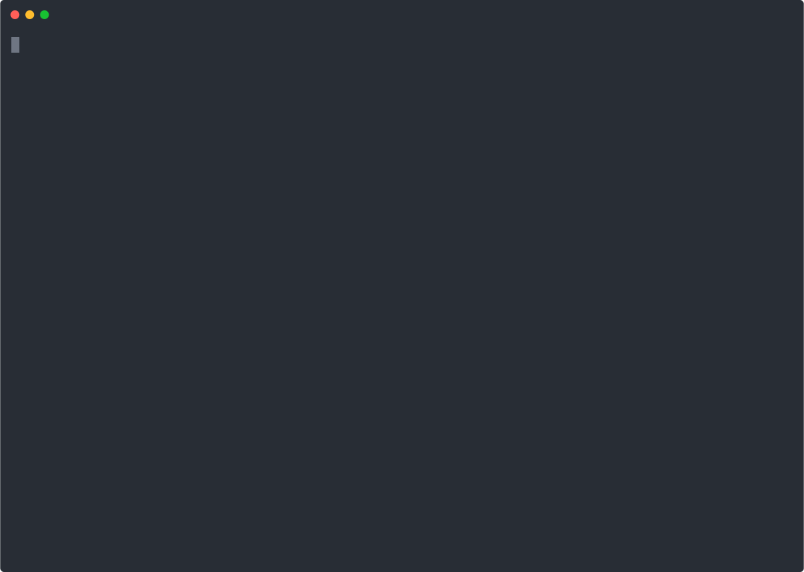

# What is KubeFire? 🔥

KubeFire is to create and manage Kubernetes clusters running on FireCracker microVMs via **weaveworks/ignite**. 

- Uses independent rootfs and kernel from OCI images instead of traditional VM images like qcow2, vhd, etc 
- Uses containerd to manage Firecracker processes
- Have different cluster bootstappers to provision Kubernetes clusters like Kubeadm, K3s, Rancher RKE, RKE2, RancherD, and K0s
- Supports deploying clusters on different architectures like x86_64/AMD64 and ARM64/AARCH64 (ex: K3s, RKE2, K0s)



# Getting Started

## Installing KubeFire

For official releases, please install the latest release via the below command or use [`huber`](https://github.com/innobead/huber)

```console
curl -sfSL https://raw.githubusercontent.com/innobead/kubefire/master/hack/install-release-kubefire.sh | bash
```

or 

```console
huber install kubefire
```

For development purpose, please make sure go 1.14 installed, then build and install `kubefire` in the `GOBIN` path.

```console
make install
```

## Quickstart

Running below commands is to quickly have a cluster deployed by kubeadm running in minutes.

```console
kubefire install
kubefire cluster create demo
```

## Installing or Updating Prerequisites

To be able to run kubefire commands w/o issues like node/cluster management, there are some prerequisites to have. 
Please run `kubefire install` command with root permission (or sudo without password) to install or update these prerequisites via the below steps.

- Check virtualization supported
- Install necessary components including runc, containerd, CNI plugins, and Ignite

> Notes: 
> - To uninstall the prerequisites, run `kubefire uninstall`.
> - To check the installation status, run `kubefire info`. 
> - For ARM64, `containerd` and `runc` will not be automatically installed by `kubefire install`, because there are no official ARM64 artifacts provided by https://github.com/containerd/containerd and https://github.com/opencontainers/runc. 
> Please install manually via package manager on host (ex: Ubuntu apt, OpenSUSE zypper, CentOS yum, etc).

[](https://asciinema.org/a/tQKqYjojnsgZOjZqrGbF9Zqh0)

## Bootstrapping Cluster

### Bootstrapping with command options, or a declarative config file

`cluster create` provides detailed options to configure the cluster, but it also provides `--config` to accept a cluster configuration file to bootstrap the cluster as below commands. 

#### With command options
```console
❯ kubefire cluster create -h
Creates cluster

Usage:
  kubefire cluster create [name] [flags]

Flags:
  -b, --bootstrapper string    Bootstrapper type, options: [kubeadm, k3s, rke, rke2, k0s] (default "kubeadm")
  -c, --config string          Cluster configuration file (ex: use 'config-template' command to generate the default cluster config)
  -o, --extra-options string   Extra options (ex: key=value,...) for bootstrapper
  -f, --force                  Force to recreate if the cluster exists
  -h, --help                   help for create
  -i, --image string           Rootfs container image (default "ghcr.io/innobead/kubefire-opensuse-leap:15.2")
      --kernel-args string     Kernel arguments (default "console=ttyS0 reboot=k panic=1 pci=off ip=dhcp security=apparmor apparmor=1")
      --kernel-image string    Kernel container image (default "ghcr.io/innobead/kubefire-ignite-kernel:4.19.125-amd64")
      --master-count int       Count of master node (default 1)
      --master-cpu int         CPUs of master node (default 2)
      --master-memory string   Memory of master node (default "2GB")
      --master-size string     Disk size of master node (default "10GB")
      --no-cache               Forget caches
      --no-start               Don't start nodes
  -k, --pubkey string          Public key
  -v, --version string         Version of Kubernetes supported by bootstrapper (ex: v1.18, v1.18.8, empty)
      --worker-count int       Count of worker node
      --worker-cpu int         CPUs of worker node (default 2)
      --worker-memory string   Memory of worker node (default "2GB")
      --worker-size string     Disk size of worker node (default "10GB")

Global Flags:
  -l, --log-level string   log level, options: [panic, fatal, error, warning, info, debug, trace] (default "info")

```

#### With declarative config file

```console
# Geneate a cluster template configuration, then update the config as per your needs
❯ kubefire cluster config-template > cluster.yaml

❯ cat cluster.yaml   
name: ""
bootstrapper: kubeadm
pubkey: ""
prikey: ""
version: ""
image: ghcr.io/innobead/kubefire-opensuse-leap:15.2
kernel_image: ghcr.io/innobead/kubefire-ignite-kernel:4.19.125-amd64
kernel_args: console=ttyS0 reboot=k panic=1 pci=off ip=dhcp security=apparmor apparmor=1
extra_options: {}
deployed: false
master:
  count: 1
  memory: 2GB
  cpus: 2
  disk_size: 10GB
worker:
  count: 0
  memory: 2GB
  cpus: 2
  disk_size: 10GB

# Create a cluster with the config file
❯ kubeifre cluster create demo --config=cluster.yaml
```

### Bootstrapping with selectable Kubernetes versions

```console
# Create a cluster with the latest versions w/o any specified version
❯ kubefire cluster create demo

# Create a cluster with the latest patch version of v1.18
❯ kubefire cluster create demo --version=v1.18

# Create a cluster with a valid specific version v1.18.8
❯ kubefire cluster create demo --version=v1.18.8

# Create a cluster with the latest patch version of supported minor releases
❯ kubefire cluster create demo --version=v1.17
❯ kubefire cluster create demo --version=v1.16

# If the version is outside the supported versions (last 3 minor versions given the latest is v1.18), the cluster creation will be not supported 
❯ kubefire cluster create demo --version=v1.15
```

### Bootstrapping with Kubeadm
> Supports [the latest supported version](https://dl.k8s.io/release/stable.txt) and last 3 minor versions.

```console
❯ kubefire cluster create demo --bootstrapper=kubeadm
```

#### Add extra Kubeadm deployment options

To add extra deployment options of the control plane components, use `--extra-options` of `cluster create` command to provide `init_options`, `api_server_options`, `controller_manager_options` or `scheduler_options` key-value pairs as the below example. 

> Note: the key-value pairs in `--extra-options` are separated by comma.

- Add extra options of `kubeadm init` into `init_options='<option>,...'`.
- Add extra options of `API Server` into `api_server_options='<option>,...'`.
- Add extra options of `Controller Manager` into `controller_manager_options='<option>,...'`.
- Add extra options of `Scheduler` into `scheduler_options='<option>,...'`.

```console
❯ kubefire cluster create demo --bootstrapper=kubeadm --extra-options="init_options='--service-dns-domain=yourcluster.local' api_server_options='--audit-log-maxage=10'"
```

[](https://asciinema.org/a/lQfFfMa1zCXWvz321eUqhNyxB)

### Bootstrapping with K3s
> Supports [the latest supported version](https://update.k3s.io/v1-release/channels/latest) and last 3 minor versions.

Please note that K3s only officially supports Ubuntu 16.04 and 18.04, the kernel versions of which are 4.4 and 4.15. 
Therefore, if using the prebuilt kernels, please use `4.19` (which is the default kernel used) instead of `5.4`, otherwise there will be some unexpected errors happening. 
For rootfs, it's no problem to use other non-Ubuntu images.

```console
❯ kubefire cluster create demo --bootstrapper=k3s
```

### Bootstrapping with K3s on ARM64

From 0.3.0, it's able to deploy K3s cluster on ARM64 architecture.

> Notes:
> K3s supported only, and Kubeadm will be planned to support in the future.

[](https://asciinema.org/a/6UVU9PVdcqAAtgN17N9EAaSFq)

#### Add extra K3s deployment options

To add extra deployment options of the server or agent nodes, use `--extra-options` of `cluster create` command to provide `server_install_options` or `agent_install_options` key-value pairs as the below example. 

> Note: the key-value pairs in `--extra-options` are separated by a comma.

- Add extra options of `k3s server` into `server_install_options='<k3s server option>,...'`.
- Add extra options of `k3s agent` into `agent_install_options='<k3s agent option>,...'`.

```console
❯ kubefire cluster create demo --bootstrapper=k3s --extra-options="server_install_options='--disable=traefik,--disable=metrics-server'"
```

[](https://asciinema.org/a/HqmfS4wZP7pPVS3E7M7gwAzmA)

### Bootstrapping with RKE

```console
❯ kubefire cluster create demo --bootstrapper=rke
```

#### Add extra RKE deployment options

To add extra deployment options of the RKE cluster, use `--extra-options` of `cluster create` command to provide the below options as key-value pairs. 

> Note: the key-value pairs in `--extra-options` are separated by a comma.

- Add `kubernetes_version` into `kubernetes_version='<RKE supported kubernetes version>'`.
- Add `cluster_config_file` into `cluster_config_file='<RKE customized cluster.yaml>,...'`.

```console
❯ cat /tmp/cluster.yaml
network:
    plugin: calico

❯ kubefire cluster create demo --bootstrapper=rke --extra-options="kubernetes_version=v1.18.12-rancher1-1 cluster_config_file=/tmp/cluster.yaml"
```

### Bootstrapping with RKE2

```console
❯ kubefire cluster create demo --bootstrapper=rke2
```

#### Add extra RKE2 deployment options

To add extra deployment options of the RKE cluster, use `--extra-options` of `cluster create` command to provide the below options as key-value pairs.

> Note: the key-value pairs in `--extra-options` are separated by a comma.

- Add extra options of `rke2 server` into `server_install_options='<rke2 server option>,...'`.
- Add extra options of `rke2 agent` into `agent_install_options='<rke2 agent option>,...'`.

```console
❯ kubefire cluster create demo --bootstrapper=rke2 --extra-options="server_install_options='--node-label=label1,--node-taint=key=value:NoSchedule'"
```

### Bootstrapping with K0s

```console
❯ kubefire cluster create demo --bootstrapper=k0s
```

#### Add extra K0s deployment options

To add extra deployment options of the RKE cluster, use `--extra-options` of `cluster create` command to provide the below options as key-value pairs.

> Note: the key-value pairs in `--extra-options` are separated by a comma.

- Add extra options of `k0s server` into `server_install_options='<k0s server option>,...'`
- Add extra options of `k0s worker` into `worker_install_options='<k0s worker option>,...'`
- Add `cluster_config_file` into `cluster_config_file='<k0s customized cluster.yaml>,...'`

```console
❯ kubefire cluster create demo --bootstrapper=k0s --extra-options="server_install_options='--debug' cluster_config_file=/tmp/cluster.yaml"
```

## Accessing Cluster

During bootstrapping, the cluster folder is created at `~/.kubefire/clusters/<cluster name>`. After bootstrapping, there are several files generated in the folder.

- **admin.conf**
  
  The kubeconfig, downloaded from one of master nodes

- **cluster.yaml**

  The cluster config manifest is for creating the cluster. There is no declarative management based on it for now, but maybe it will be introduced in the future.

- **key, key.pub**
  
  The private and public keys for SSH authentication to all nodes in the cluster.
  
There are two ways below to operate the deployed cluster. After having a valid KUBECONFIG setup, run kubectl commands as usual.

1. run `eval $(kubefire cluster env <cluster name>)` to update KUBECONFIG pointing to `~/.kubefire/clusters/<cluster name>/admin.conf`.
2. run `kubefire node ssh <master node name>` to ssh to one of master nodes, then update KUBECONFIG pointing to `/etc/kubernetes/admin.conf`. For K3s, the kubeconfig is `/etc/rancher/k3s/k3s.yaml` instead.

# Usage

## CLI Commands

Make sure to run kubefire commands with root permission or sudo without password, because ignite needs root permission to manage Firecracker VMs for now, but it is planned to improve in the future release.

```console
❯ kubefire -h
KubeFire, creates and manages Kubernetes clusters using FireCracker microVMs

Usage:
  kubefire [flags]
  kubefire [command]

Available Commands:
  cache       Manages caches
  cluster     Manages clusters
  help        Help about any command
  image       Shows supported RootFS and Kernel images
  info        Shows info of prerequisites, supported K8s/K3s versions
  install     Installs or updates prerequisites
  kubeconfig  Manages kubeconfig of clusters
  node        Manages nodes
  uninstall   Uninstalls prerequisites
  version     Shows version

Flags:
  -h, --help               help for kubefire
  -l, --log-level string   log level, options: [panic, fatal, error, warning, info, debug, trace] (default "info")

```

```console
# Show version
❯ kubefire version

# Show supported RootFS and Kernel images
❯ kubefire image

# Show prerequisites information
❯ kubefire info

# Show supported K8s/K3s versions by builtin bootstrappers
❯ kubefire info -b

# Install or Update prerequisites
❯ kubefire install 

# Uninstall prerequisites
❯ kubefire uninstall

# Create a cluster
❯ kubefire cluster create

# Create a cluster w/ a selected version
❯ kubefire cluster create --version=[v<MAJOR>.<MINOR>.<PATCH> | v<MAJOR>.<MINOR>]

# Delete clusters
❯ kubefire cluster delete

# Show a cluster info
❯ kubefire cluster show

# Show a cluster config
❯ kubefire cluster config

# Create the default cluster config template
❯ kubefire cluster config-template

# Stop a cluster
❯ kubefire cluster stop

# Start a cluster
❯ kubefire cluster start

# Restart a cluster
❯ kubefire cluster restart

# List clusters
❯ kubefire cluster list

# Print environment variables of cluster (ex: KUBECONFIG)
❯ kubefire cluster env

# Print cluster kubeconfig
❯ kubefire kubeconfig show

# Download cluster kubeconfig
❯ kubefire kubeconfig download

# SSH to a node
❯ kubefire node ssh

# Show a node info
❯ kubefire node show

# Stop a node
❯ kubefire node stop

# Start a node
❯ kubefire node start

# Restart a node
❯ kubefire node restart

# Show cache info
❯ kubefire cache show

# Delete caches
❯ kubefire cache delete
```

# Troubleshooting

If encountering any unexpected behavior like ignite can't allocate valid IPs to the created VMs. 
Please try to clean up the environment, then verify again. If the issues still cannot be resolved by environment cleanup, please help create issues. 

```console
kubefire unisntall
kubefire install
```  
 
# Supported Container Images for RootFS and Kernel

Besides below prebuilt images, you can also use the images provided by [weaveworks/ignite](https://github.com/weaveworks/ignite/tree/master/images).

## RootFS images
- ghcr.io/innobead/kubefire-opensuse-leap:15.3
- ghcr.io/innobead/kubefire-sle15:15.3
- ghcr.io/innobead/kubefire-rocky:8
- ghcr.io/innobead/kubefire-centos:8
- ghcr.io/innobead/kubefire-ubuntu:18.04, 20.04, 20.10

## Kernel images (w/ AppArmor enabled)
- ghcr.io/innobead/kubefire-ignite-kernel:5.4.43-amd64
- ghcr.io/innobead/kubefire-ignite-kernel:4.19.125-amd64 (default)
- ghcr.io/innobead/kubefire-ignite-kernel:5.4.43-arm64
- ghcr.io/innobead/kubefire-ignite-kernel:4.19.125-arm64 (default)

# References

- [Firecracker](https://github.com/firecracker-microvm/firecracker)
- [Ignite](https://github.com/weaveworks/ignite)
- [K3s](https://github.com/k3s-io/k3s) 
- [Kubeadm](https://github.com/kubernetes/kubeadm)
- [Rancher RKE](https://rancher.com/docs/rke/latest/en/)
- [Rancher RKE2](https://docs.rke2.io/)
- [K0s](https://github.com/k0sproject/k0s)
